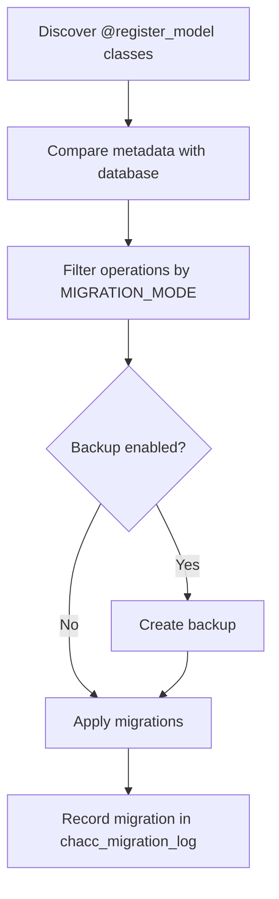

# Database and Migrations

ChaCC API uses SQLAlchemy for database access and Alembic comparison utilities
for automatic migrations. The migration runner tracks applied operations so
migrations are not repeated.

## Database engines

| Engine | Use case | Notes |
| --- | --- | --- |
| SQLite | Local development and simple deployments | Stores `chaccapi.db` in the current working directory by default. The file name and path can be changed with `SQLITE_DATABASE_NAME` and `SQLITE_DATABASE_PATH`. |
| PostgreSQL | Production | Uses native UUID and requires full connection settings. Supports enum migrations with `alembic-postgresql-enum`. |

## Base model

Import the base model and register each table model:

```python
from chacc_api import ChaCCBaseModel, register_model
from sqlalchemy import Column, String
@register_model
class Project(ChaCCBaseModel):
    __tablename__ = "projects"
    name = Column(String, nullable=False)
```

The generated table name defaults to the class name in lowercase plus `s`, unless
`__tablename__` is set.

## GUID type

The `GUID` type decorator stores UUIDs as native PostgreSQL UUID values and as
36-character strings on SQLite and other databases. It returns Python `uuid.UUID`
instances from the database.

`ChaCCBaseModel.uuid` now defaults to `uuid7` instead of `uuid4`. Existing rows
are not affected; new rows receive version 7 UUIDs. On Python versions without
native `uuid7` support, install `uuid-utils` to provide the implementation.

## PostgreSQL enum migrations

`alembic-postgresql-enum` is loaded when installed and adds support for enum
operations in Alembic:

- `create_enum` — creates enum types before adding enum-backed tables or columns.
- `sync_enum_values` — synchronizes enum values with database metadata.
- `drop_enum` — handles enum type removal.

Enum types are created before adding enum-backed tables or columns in PostgreSQL,
ensuring safe operation ordering.

In `auto` mode, `create_enum` and `sync_enum_values` are treated as safe
operations. `drop_enum` is recognized and applied during full migration flow.

If enum metadata changes are detected, `alembic-postgresql-enum` must be
installed to prevent enum-related migration failures.

## Timestamps

`ChaCCBaseModel` uses SQLAlchemy events to set:

- `created_at` on insert when missing.
- `updated_at` on insert and update.

## Migration modes

| Mode | Behavior |
| --- | --- |
| `preview` | Compares metadata and returns pending operations without applying them. |
| `auto` | Applies safe operations and filters destructive operations. |
| `full` | Applies all detected operations, including destructive operations. |

Safe operations include adding tables, adding columns, adding indexes, adding
constraints, creating foreign keys, modifying types, modifying nullability,
modifying defaults, and enum synchronization.

Destructive operations such as dropping tables are skipped in `auto` mode.

## Migration lifecycle



## Backup and restore

Enable backups with:

```bash
MIGRATION_BACKUP=true
MIGRATION_BACKUP_DIR=backups
```

SQLite backups copy the database file. PostgreSQL backups use `pg_dump` and
restore through `psql`.

Backup files are named with timestamps:

- SQLite: `chacc_backup_YYYYMMDD_HHMMSS.db`
- PostgreSQL: `chacc_backup_YYYYMMDD_HHMMSS.sql`

## Migration tracker table

The runner creates `chacc_migration_log` to record applied migrations.

| Column | Type | Purpose |
| --- | --- | --- |
| `id` | Integer / serial | Internal row id. |
| `version_num` | String | Unique migration version. |
| `description` | Text | Human-readable operation summary. |
| `checksum` | String | Checksum for the operation details. |
| `applied_at` | Timestamp | Application time. |
| `rollback_available` | Integer | Rollback marker. |

The tracker table is excluded from destructive drop detection so it is not
accidentally removed by schema comparison.

## Idempotency

The runner catches `ProgrammingError` and `OperationalError` messages containing
`already exists` or `duplicate`, allowing repeated startup migrations to complete
without failing when resources already exist.

## SQLite compatibility

SQLite migrations use `batch_alter_table()` for column, type, nullability,
default, index, and constraint changes. This avoids common SQLite limitations
around direct table alteration.
