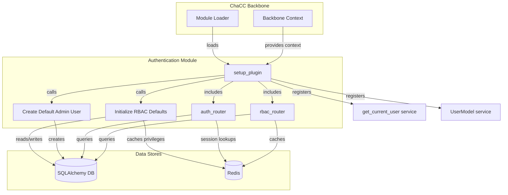
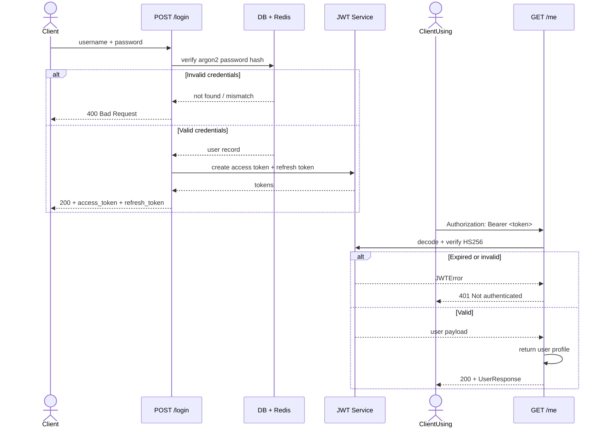
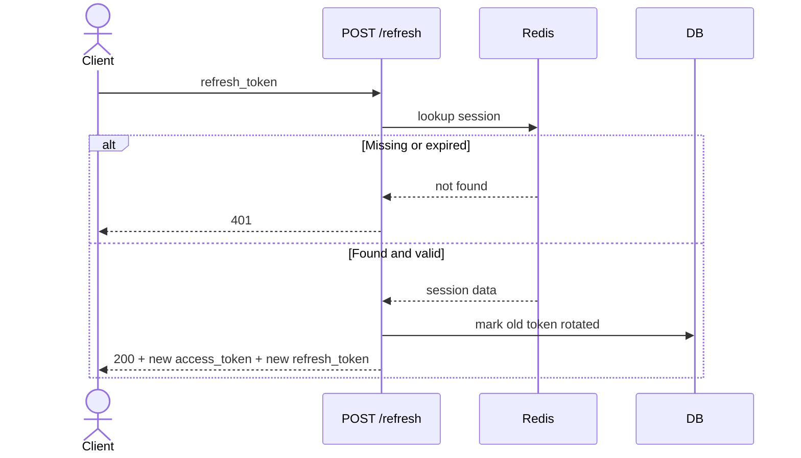
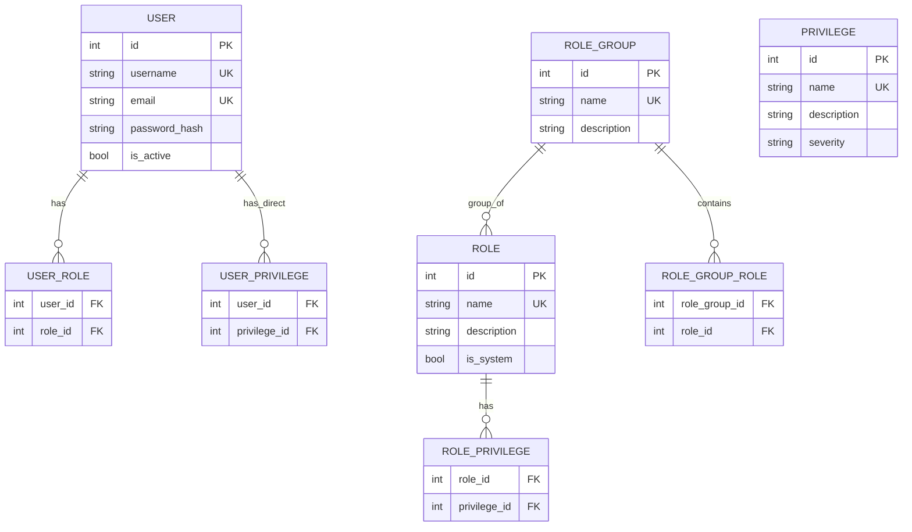

# Official Chacc Authentication

> The official authentication module for ChaCC API. Provides user management, JWT authentication, and role-based access control (RBAC).

---

## Overview

`chacc-authentication` is the official ChaCC API module that handles user identity. It registers a `get_current_user` dependency that other modules can use to protect their routes.

### What it provides

- User registration and login
- JWT access tokens and refresh tokens
- Password hashing (Argon2)
- Role-based access control (RBAC)
- Default admin user creation on first startup
- Session management with token rotation

### Module info

| Field | Value |
|---|---|
| Name | `chacc-authentication` |
| Display name | Authentication Module |
| Version | `0.1.0` |
| Author | Jonas G Mwambimbi |
| Base path | `/authentication` |
| License | MIT |

---

## Features

### Authentication

- `POST /authentication/register` — Register new user (when self-registration is enabled)
- `POST /authentication/login` — Login with username and password
- `POST /authentication/refresh` — Get new access token from refresh token
- `POST /authentication/revoke` — Revoke a specific refresh token
- `POST /authentication/logout` — Logout from all sessions

### User Management

- `GET /authentication/me` — Get current user profile
- `PUT /authentication/me` — Update profile or change password
- `DELETE /authentication/me` — Delete current user account
- `GET /authentication/users` — List all users (requires auth)

### RBAC

- Privileges, roles, and role groups
- Default `ADMIN` and `USER` roles seeded on first startup
- Per-route privilege enforcement with `require_privilege(...)`
- Redis cache for privilege lookups

### Services for other modules

- `get_current_user` — FastAPI dependency factory
- `UserModel` — SQLAlchemy user model reference

---

## Architecture



### How it fits in the module lifecycle


Authentication module registers:

- SQLAlchemy models: `User`, `OAuthSession`, `Privilege`, `Role`, `RoleGroup`
- Routes under `/authentication` and `/authentication/rbac`
- Services: `get_current_user`, `UserModel`

---

## Authentication Flow



### Refresh token flow



---

## RBAC Model



### Default privileges

| Privilege | Severity |
|---|---|
| `ALL` | CRITICAL |
| `READ_OWN_PROFILE` | LOW |
| `WRITE_OWN_PROFILE` | MEDIUM |
| `READ_USERS` | MEDIUM |
| `WRITE_USERS` | HIGH |
| `READ_ROLES` | MEDIUM |
| `WRITE_ROLES` | HIGH |
| `READ_PRIVILEGES` | MEDIUM |
| `WRITE_PRIVILEGES` | VERY HIGH |
| `MANAGE_SYSTEM` | CRITICAL |
| `READ_ROLE_GROUPS` | MEDIUM |
| `WRITE_ROLE_GROUPS` | HIGH |
| `WRITE_USER_ROLES` | HIGH |
| `WRITE_USER_PRIVILEGES` | HIGH |
| `READ_USER_PRIVILEGES` | MEDIUM |
| `READ_PASSWORD_POLICY` | MEDIUM |
| `WRITE_PASSWORD_POLICY` | HIGH |

### Default roles

| Role | Privileges |
|---|---|
| `ADMIN` | `ALL`, `MANAGE_SYSTEM` |
| `USER` | `READ_OWN_PROFILE`, `WRITE_OWN_PROFILE` |
| `POWER_USER` | `READ_OWN_PROFILE`, `WRITE_OWN_PROFILE`, `READ_USERS` |

---

## Installation

Install the module into a ChaCC API project:

```bash
chacc build plugins/chacc-authentication
chacc deploy
```

Or install from PyPI when available:

```bash
pip install chacc-authentication
```

### Requirements

- Python 3.10+
- ChaCC API `>=1.0.0`
- PostgreSQL or SQLite database
- Redis (for session cache and RBAC privilege cache)

### Python dependencies

The module requires:

```
argon2-cffi
python-jose[cryptography]
python-multipart
```

---

## Configuration

Set these environment variables in your `.env` or deployment configuration:

### Required

```bash
SECRET_KEY=replace-with-a-strong-random-secret
```

`SECRET_KEY` is used to sign JWT tokens. Use a long, unpredictable value in production.

### Optional

```bash
AUTHENTICATION_ENABLE_SELF_REGISTRATION=true
```

When `true`, `POST /authentication/register` is mounted and users can create accounts. Default: `false`.

```bash
AUTHENTICATION_DEFAULT_ADMIN_USERNAME=admin
AUTHENTICATION_DEFAULT_ADMIN_PASSWORD=admin123
```

Credentials for the default admin account created on first startup. Override these in production immediately.

> **Warning:** Change `AUTHENTICATION_DEFAULT_ADMIN_PASSWORD` before running in production. The default account is only created on first startup when no admin exists.

### Module-specific config access

Other modules can read auth configuration through the context:

```python
secret_key = context.get_module_config("SECRET_KEY", "authentication")
self_reg = context.get_module_config("ENABLE_SELF_REGISTRATION", "authentication", default="false")
```

---

## API Endpoints

All paths are prefixed with `/authentication` unless otherwise stated.

### Register

```http
POST /authentication/register
```

Enabled only when `AUTHENTICATION_ENABLE_SELF_REGISTRATION=true`.

**Request body:**

```json
{
  "username": "jane",
  "email": "jane@example.com",
  "password": "secure-password",
  "passwordConfirm": "secure-password",
  "first_name": "Jane",
  "last_name": "Doe"
}
```

**Response:**

```json
{
  "uuid": "550e8400-e29b-41d4-a716-446655440000",
  "username": "jane",
  "first_name": "Jane",
  "middle_name": null,
  "last_name": "Doe",
  "email": "jane@example.com",
  "is_active": true
}
```

### Login

```http
POST /authentication/login
```

**Request body:**

```json
{
  "username": "jane",
  "password": "secure-password"
}
```

**Response:**

```json
{
  "access_token": "eyJhbGciOiJIUzI1NiIs...",
  "refresh_token": "refresh_...",
  "token_type": "bearer",
  "access_token_expires_at": "2026-06-16T14:05:00Z",
  "access_token_expiry": 900,
  "refresh_token_expiry": 604800
}
```

- `access_token` — short-lived bearer token (15 minutes)
- `refresh_token` — long-lived token for obtaining new access tokens
- `token_type` — always `bearer`

### Refresh token

```http
POST /authentication/refresh
```

**Request body:**

```json
{
  "refresh_token": "refresh_..."
}
```

Returns a new `access_token` and `refresh_token` pair.

### Revoke token

```http
POST /authentication/revoke
```

**Request body:**

```json
{
  "refresh_token": "refresh_..."
}
```

Revokes a single refresh token (logout from one device).

### Logout all

```http
POST /authentication/logout
```

Requires `Authorization: Bearer <token>`.

Revokes all refresh tokens for the current user.

### Get current user

```http
GET /authentication/me
```

Requires `Authorization: Bearer <token>`.

Returns the authenticated user profile.

### Update current user

```http
PUT /authentication/me
```

Requires `Authorization: Bearer <token>`.

```json
{
  "username": "jane-new",
  "email": "jane@example.com",
  "first_name": "Jane",
  "last_name": "Smith",
  "password": "new-password"
}
```

Optional fields are left unchanged. Omit `password` to keep existing password.

### Delete current user

```http
DELETE /authentication/me
```

Requires `Authorization: Bearer <token>`.

Permanently deletes the authenticated user account.

### List users

```http
GET /authentication/users?skip=0&limit=100
```

Requires `Authorization: Bearer <token>`.

Returns a list of all users.

### RBAC endpoints

All RBAC endpoints are under `/authentication/rbac` and require a valid bearer token. Some endpoints additionally require specific privileges.

| Method | Path | Required privilege |
|---|---|---|
| `GET` | `/rbac/privileges` | — |
| `POST` | `/rbac/privileges` | `WRITE_PRIVILEGES` |
| `GET` | `/rbac/roles` | — |
| `GET` | `/rbac/roles/{role_name}` | — |
| `POST` | `/rbac/roles` | `WRITE_ROLES` |
| `PUT` | `/rbac/roles/{role_name}/privileges` | `WRITE_ROLES` |
| `DELETE` | `/rbac/roles/{role_name}/privileges` | `WRITE_ROLES` |
| `GET` | `/rbac/me/privileges` | — |
| `GET` | `/rbac/users/{user_id}/privileges` | `READ_USER_PRIVILEGES` |
| `PUT` | `/rbac/users/{user_id}/roles` | `WRITE_USER_ROLES` |
| `DELETE` | `/rbac/users/{user_id}/roles` | `WRITE_USER_ROLES` |
| `PUT` | `/rbac/users/{user_id}/privileges` | `WRITE_USER_PRIVILEGES` |
| `DELETE` | `/rbac/users/{user_id}/privileges` | `WRITE_USER_PRIVILEGES` |
| `GET` | `/rbac/role-groups` | — |

---

## Using the Module in Your Code

Other modules and ChaCC API extensions can use the registered services.

### Protect a route

```python
from fastapi import APIRouter, Depends
router = APIRouter()
@router.get("/protected")
async def protected_route(current_user = Depends(context.get_service("get_current_user"))):
    return {"message": f"Hello {current_user.username}"}
```

### Require authentication strictly

Raise `401` if the user is not authenticated:

```python
from fastapi import HTTPException, status
@router.get("/strict")
async def strict_route(current_user = Depends(context.get_service("get_current_user"))):
    if current_user is None:
        raise HTTPException(status_code=status.HTTP_401_UNAUTHORIZED, detail="Not authenticated")
    return {"user": current_user.username}
```

### Enforce a specific privilege

```python
from module.dependencies import require_privilege
@router.delete("/admin/reset")
async def reset_system(user = Depends(require_privilege("MANAGE_SYSTEM"))):
    return {"status": "reset complete"}
```

### Check any of several privileges

```python
from module.dependencies import require_any_privilege
@router.get("/reports")
async def get_reports(user = Depends(require_any_privilege(["READ_REPORTS", "MANAGE_SYSTEM"]))):
    return {"reports": [...]}
```

### Access user privileges in a route

```python
from module.dependencies import get_user_privileges
@router.get("/my-permissions")
async def my_permissions(privileges = Depends(get_user_privileges)):
    return {"privileges": privileges}
```

---

## Security Details

- **Password hashing:** Argon2 via `argon2-cffi`
- **JWT algorithm:** HS256
- **Access token TTL:** 15 minutes (configurable per token request)
- **Refresh token TTL:** 7 days (stored in `oauth_sessions` table)
- **Token rotation:** Enabled — each refresh invalidates the old token and issues a new one
- **Bearer scheme:** `HTTPBearer` per FastAPI Security conventions

### Password requirements

The module does not enforce password complexity rules. It is recommended that client applications enforce a minimum length of 8 characters before calling register or update endpoints.

### Self-registration

Disabled by default. When enabled, anyone can call `POST /authentication/register` without authentication. This is suitable for public-facing apps but adds account spam risk.

### Default admin user

On first startup, if no users exist, an admin account is created with:

- Username from `AUTHENTICATION_DEFAULT_ADMIN_USERNAME` (default: `admin`)
- Password from `AUTHENTICATION_DEFAULT_ADMIN_PASSWORD` (default: `admin123`)

This only happens once. Change the password after first login.

---

## Module Structure

```
chacc-authentication/
├── module/
│   ├── __init__.py
│   ├── main.py              # setup_plugin entry point
│   ├── auth.py              # JWT creation, password hashing, dependency factories
│   ├── routes.py            # Authentication and user management endpoints
│   ├── routes_rbac.py       # RBAC endpoints
│   ├── context_factory.py   # Context and DB provider
│   ├── dependencies.py      # require_privilege factories
│   ├── models/
│   │   ├── __init__.py
│   │   ├── user.py          # User SQLAlchemy model
│   │   ├── session.py       # OAuthSession SQLAlchemy model
│   │   ├── rbac.py          # Privilege, Role, RoleGroup models
│   │   └── request_models.py # Pydantic schemas
│   └── services/
│       ├── login_user.py
│       ├── refresh_token.py
│       ├── revoke_token.py
│       ├── logout_all_sessions.py
│       └── rbac_service.py
├── module_meta.json
├── requirements.txt
└── README.md
```

---

## Development

### Running standalone

```bash
python module/run_tests.py standalone
```

The module is available at `http://localhost:8001/authentication/`.

### Running tests

```bash
# With virtual environment
python module/run_tests.py test
# Without virtual environment
python module/run_tests.py test --no-venv
```

### Development setup

```bash
python module/run_tests.py setup
```

Creates a virtual environment and installs dependencies.

---

## Troubleshooting

| Symptom | Solution |
|---|---|
| `401 Not authenticated` on every request | Ensure `Authorization: Bearer <token>` header is sent. Verify `SECRET_KEY` matches between token creation and verification. |
| `SECRET_KEY not configured` | Set `SECRET_KEY` in your environment variables. The module raises this error at token creation if it is missing. |
| `Token revoked successfully` but still works | The revoked token is a refresh token. The access token remains valid until it expires (15 minutes). |
| `Session not found` on refresh | The refresh token was already rotated, revoked, or expired. Log in again. |
| Default admin not created | The admin is only created when the database is empty of users. Check migration state and database connectivity. |
| `ENABLE_SELF_REGISTRATION` has no effect | Verify the value is lowercase `"true"` (not `"True"`). The module checks `.lower() == "true"`. |

---

## Dependencies

```
argon2-cffi
python-jose[cryptography]
python-multipart
```

ChaCC API provides `fastapi`, `sqlalchemy`, and `pydantic` at the platform level.
