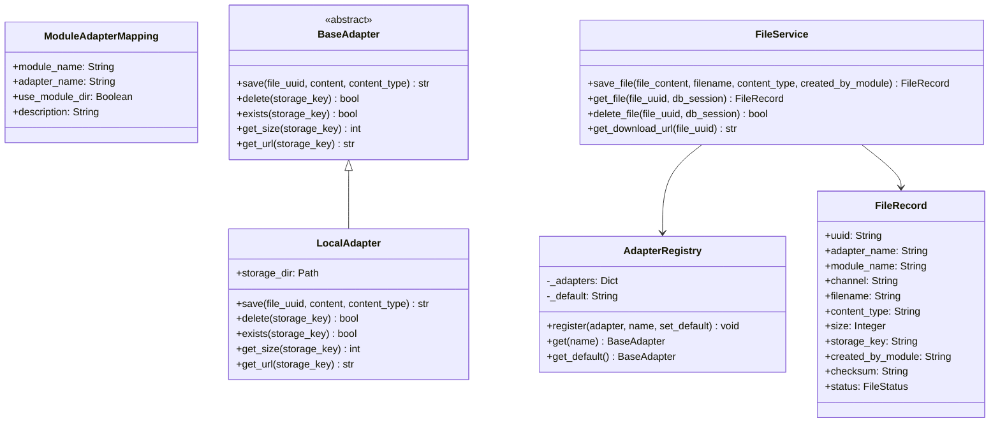
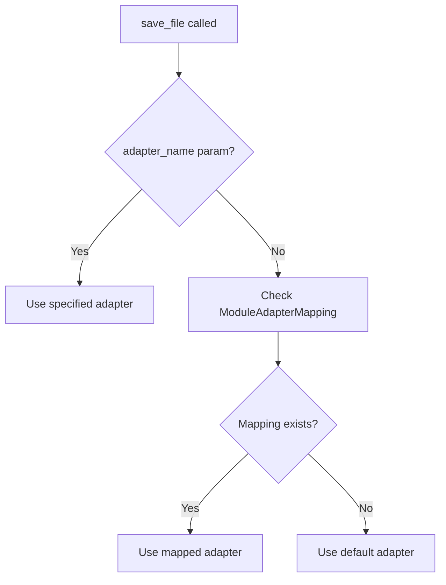

# Official ChaCC File Manager

> An official ChaCC API module providing secure, UUID-addressed file management with adapter-based storage.

## Overview

`chacc-file-manager` handles file upload, download, and deletion through a
service-backed storage layer. Files are addressed by UUID, stored through
pluggable adapters, and organized by module and optional channel.

### What it provides

- Upload, download, and delete files by UUID.
- Adapter-based storage with a built-in local adapter and support for custom
  backends such as S3.
- Module-to-adapter mapping so different modules can use different storage
  backends.
- Path traversal protection and no filesystem path exposure in API responses.
- Async streaming with `aiofiles` and HTTP range request support.

### Module info

| Field | Value |
|---|---|
| Name | `chacc-file-manager` |
| Display name | File Manager Module |
| Version | `0.1.0` |
| Author | Jonas G Mwambimbi |
| Base path | `/files` |
| License | MIT |

## Architecture



### Adapter resolution

Modules identify themselves with `created_by_module`. The service resolves the
adapter in this order:

1. Explicit `adapter_name` parameter.
2. `ModuleAdapterMapping` for the calling module.
3. Default adapter.



### Module-to-adapter mapping

Administrators map modules to adapters through the API:

```json
{"module_name": "menu", "adapter_name": "local", "use_module_dir": true}
{"module_name": "orders", "adapter_name": "s3", "use_module_dir": false}
```

Modules call the service directly and only provide `created_by_module`.

### Directory storage logic

```mermaid
flowchart TD
    A[save_file called] --> B{use_module_dir?}
    B -->|No| C[STORAGE_DIR/{uuid}]
    B -->|Yes| D{channel provided?}
    D -->|No| E[STORAGE_DIR/{module_name}/{uuid}]
    D -->|Yes| F[STORAGE_DIR/{module_name}/{channel}/{uuid}]
```

Examples:

- `use_module_dir=false` → `STORAGE_DIR/uuid`
- `use_module_dir=true, channel=""` → `STORAGE_DIR/menu/uuid`
- `use_module_dir=true, channel="images"` → `STORAGE_DIR/menu/images/uuid`

## API Endpoints

All paths are prefixed with `/files` unless otherwise stated.

### File operations

| Method | Path | Description |
| --- | --- | --- |
| `POST` | `/files/` | Upload a file (multipart form with `file` field). |
| `GET` | `/files/{uuid}/content` | Serve file content by UUID. |
| `GET` | `/files/{uuid}/content?download=1` | Download with attachment disposition. |
| `DELETE` | `/files/{uuid}` | Delete a file by UUID. |

### Metadata endpoints

| Method | Path | Description |
| --- | --- | --- |
| `GET` | `/files/adapters` | List all registered adapters. |
| `GET` | `/files/adapters/{name}` | Get adapter info. |
| `GET` | `/files/module-mappings` | List module-to-adapter mappings. |
| `POST` | `/files/module-mappings` | Create module-to-adapter mapping. |
| `DELETE` | `/files/module-mappings/{module_name}` | Delete module-to-adapter mapping. |

## Configuration

Set these environment variables in your `.env` or deployment configuration:

| Variable | Default | Description |
| --- | --- | --- |
| `CHACC_FILE_MANAGER_STORAGE_DIR` | `/tmp/chacc_file_storage` | Base directory for local file storage. |
| `CHACC_FILE_MANAGER_MAX_FILE_SIZE` | `10485760` | Maximum upload size in bytes (10 MB). |

## Installation

Install the module into a ChaCC API project:

```bash
chacc build plugins/chacc-file-manager
chacc deploy
```

Or from PyPI when available:

```bash
pip install chacc-file-manager
```

### Requirements

- Python 3.10+
- ChaCC API `>=1.0.0`
- `aiofiles` for async file streaming

## Creating custom adapters

Implement `BaseAdapter` and register it in `main.py`:

```python
from file_manager.adapters.base import BaseAdapter
from file_manager.services import AdapterRegistry
class S3Adapter(BaseAdapter):
    name = "s3"
    async def save(self, file_uuid: str, content: bytes, content_type: str) -> str:
        # Upload to S3
        return f"s3://bucket/{file_uuid}"
    async def delete(self, storage_key: str) -> bool:
        # Delete from S3
        return True
registry = AdapterRegistry()
registry.register(S3Adapter(bucket="my-bucket"), name="s3")
```

## Testing

```bash
pytest src/tests/ -v
```

## Security

- Path traversal protection via validated storage paths.
- Files never expose filesystem paths in API responses.
- Content-Disposition defaults to `inline` for safe browser rendering.
