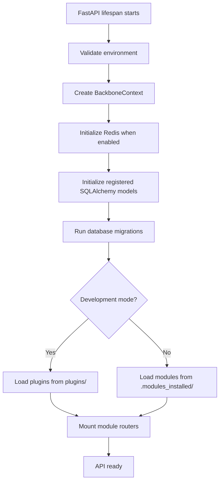
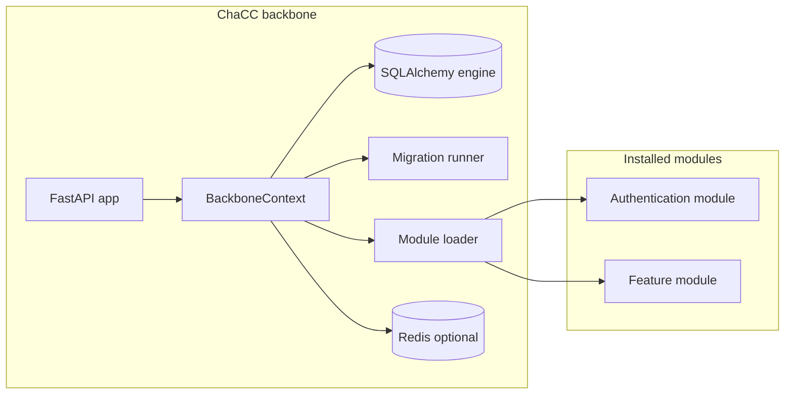

# Overview

## The problem ChaCC solves

Tired of setting up the same API boilerplate? ChaCC is a running server out of the box. Build an API module once, share it like a meme (but actually useful), and deploy it anywhere a ChaCC instance runs. Stop rebuilding. Start shipping.

## What ChaCC is

ChaCC API is a modular FastAPI application platform where modules own their domain logic and mount their own FastAPI routers into the backbone.

The backbone owns the HTTP server, configuration validation, database engine, and database migrations, module registry, dependency resolution, rate limiting, and CLI tooling.

## Current pre-release

| Item | Value |
| --- | --- |
| Package | `chacc-api` |
| Version | `1.0.0-b4.1` |
| Runtime | Python 3.10, 3.11, or 3.12 |
| Web framework | FastAPI |
| Database | SQLite by default, PostgreSQL supported |
| License | Apache-2.0 |

## Core concepts

### Backbone

The backbone is the FastAPI application which validates the environment, initializes the database, runs
migrations, and loads modules.

### Module

A module is a fastapi application plus a `module_meta.json` file. A module can include
models, routes, services, tests, and requirements. It is loaded by the backbone
through an entry point function which returns FastAPI `APIRouter`.

### `.chacc` package

A `.chacc` package is an archive containing the module source, metadata, and
optional `requirements.txt`. The CLI builds this archive with `chacc build` command.

### BackboneContext

`BackboneContext` is passed into each module's `setup_plugin(context)` function.
It exposes shared services:

| Context member | Purpose |
| --- | --- |
| `context.app` | Main FastAPI application. |
| `context.limiter` | SlowAPI limiter for route-level throttling. |
| `context.logger` | Centralized logger. |
| `context.get_db` | Database session dependency. It is a synchronous session and should be treated as such. |
| `context.register_service()` | Register a named service for other modules. |
| `context.get_service()` | Retrieve a named service. |
| `context.get_module_config()` | Read module-specific environment configuration. |

## Runtime startup flow

## Architecture

## Module lifecycle

1. **Discover**: the loader scans installed `.chacc` archives or development
   plugin directories.
2. **Resolve dependencies**: module requirements are combined with backbone
   requirements and resolved through the dependency manager.
3. **Extract**: archives are unpacked into `.modules_loaded/`.
4. **Synchronize**: `ModuleRecord` rows are created, updated, or removed.
5. **Discover models**: Python files are imported so `@register_model` classes
   are added to the model registry.
6. **Migrate**: the migration runner compares metadata with the database.
7. **Mount**: each enabled module returns an `APIRouter`, which the backbone
   includes at the configured prefix.

## Core API surface

| Endpoint | Method | Purpose |
| --- | --- | --- |
| `/` | `GET` | Welcome message for the backbone. |
| `/health` | `GET` | Basic liveness check. |
| `/health/ready` | `GET` | Readiness check including database connectivity. |
| `/health/live` | `GET` | Lightweight process liveness check. |
| `/modules` | `POST` | Upload and install a `.chacc` module package. |
| `/modules` | `GET` | List installed module records. |
| `/modules/{module_name}/enable` | `POST` | Mark a module enabled. Requires restart. |
| `/modules/{module_name}/disable` | `POST` | Mark a module disabled. Requires restart. |
| `/modules/{module_name}/uninstall` | `DELETE` | Remove module archive, extracted code, and DB record. Requires restart. |
